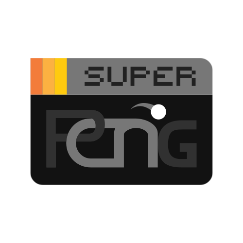

  

  <h1>SuperPong</h1>

Imagine classical pong, but with the addition of “super” abilities. That’s super pong! New paddle types with super abilities, and new ball effects and sorts. All made with the trusty Godot Engine.

## Paddles

### Classic Paddle

Just your ordinary regular paddle. It may not be good at one thing, but it's enough to do the job, I guess.

| **Stat** | **Value** |
|:-:|:-:|
| Icon |  |
| Color |  |
| Height | `200` |
| Speed | `100` |
| Sprint Speed | `150` |
| Ball Maneuver | `0.5` |

### Castle Paddle

Ever felt like a loser who can't defend a damn ball? Well, don't I have the solution for you! `Castle` is gonna be your new best friend.

#### • Ability
When pressing the ability button, it expands even more. Expanding slows you down though.

| **Stat** | **Value** | (*Extended*) |
|:-:|:-:|:-:|
| Icon |  | (bigger) |
| Color |  | `-` |
| Height | `320` | `400` |
| Speed | `80` | `48` |
| Sprint Speed | `×` | `-` |
| Ball Maneuver | `0.66` | `-` |

### Speedy Paddle

Ever feel like running away from your problems but you just *can't*? Yeah, me too. Until we find a way to do that, how about speedster paddle for you?

#### • Ability
When pressing the ability button, it runs quick to the y-level of the ball. You ought to have good timing and wait for it to recharge though.

| **Stat** | **Value** |
|:-:|:-:|
| Icon |  |
| Color |  |
| Height | `140` |
| Speed | `150` |
| Sprint Speed | `225` |
| Ball Maneuver | `0.35` |

### Strike Paddle

`Strike` is when you're tired of playing the defense, play the offensive role for once now.

#### • Ability
When pressing the ability button, it reflects the ball if it's in your half. You'll have to wait for it to recharge to reuse it though.

| **Stat** | **Value** |
|:-:|:-:|
| Icon |  |
| Color |  |
| Height | `200` |
| Speed | `100` |
| Sprint Speed | `150` |
| Ball Maneuver | `0.85` |

### Tempo Paddle

Time control is amazing, you can touch bo- I mean you can uhhh, fuck. `Tempo` just means time in Italian, okay?

#### • Ability
When pressing the ability button, the ball gets slowed down by a factor of `0.5`, and pressing it again while the ability is active, disables it. You'll have to wait for it to recharge to reuse it though.

| **Stat** | **Value** | (*Slowing*) |
|:-:|:-:|:-:|
| Icon |  | (black clock hand) |
| Color |  | `-` |
| Height | `170` | `-` |
| Speed | `100` | `-` |
| Sprint Speed | `120` | `150` |
| Ball Maneuver | `0.66` | `1.25` |

---

  Made with
   
  

$${and\space\color{red}Love}$$
